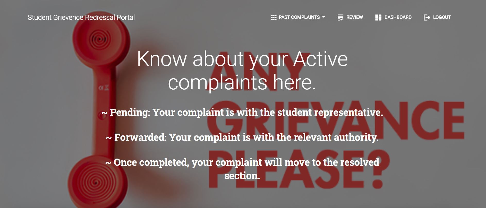
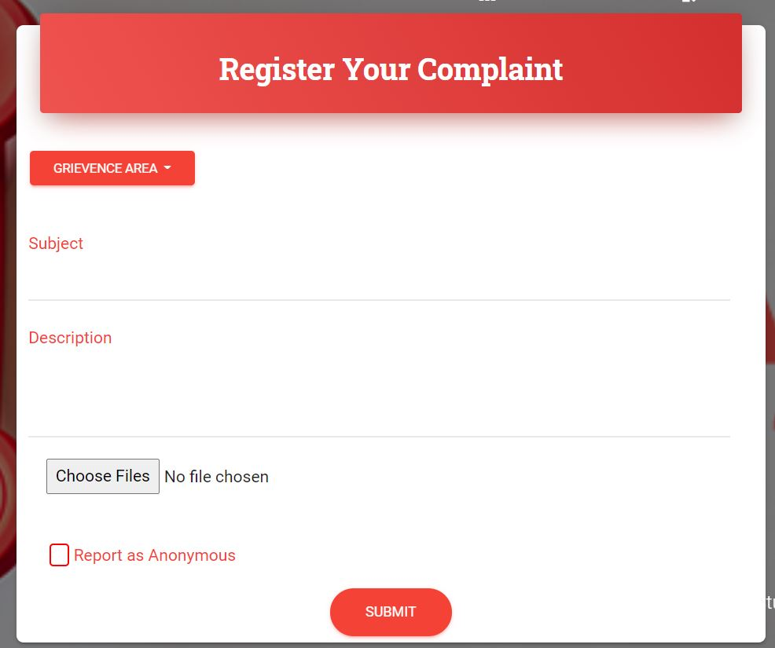

<h1 align="center">Student Grievance Redressal Portal</h1>

## Introduction:
  <strong>Theme: E-Administration</strong> 
  While college life is generally full of zeal, fun, and amusement, students can also run into several issues along the way. Now, these issues can be of various types, ranging from hostels, to campus, to their personal life. Our portal aims to bring all these issues to the relevant authorities in a structured manner that'll be beneficial to both the students and the administration, while maintaining e-records of all the complaints and their details.
## Screenshots

## Technology Stack:
  1) HTML
  2) Bootstrap
  3) Node.JS
  4) Express JS
  5) MongoDB
  6) EJS
  

## Contributors:

Team Name: FairyTale

* [Prakhar Vijay](https://github.com/furher023)
* [Karandeep Singh](https://github.com/karandeep09)
* [Shikher Sinha](https://github.com/shikher25git)
* [Garima Ahuja](https://github.com/garima0508)

Presentation: [FairyTale_Hack36](https://docs.google.com/presentation/d/1axXpajTrNLitP_YvezBTEyd4LIndKr-T5-Fi_DqjKqc/edit?usp=sharing)  
Demo Video: [Link](#)

### Made at:

